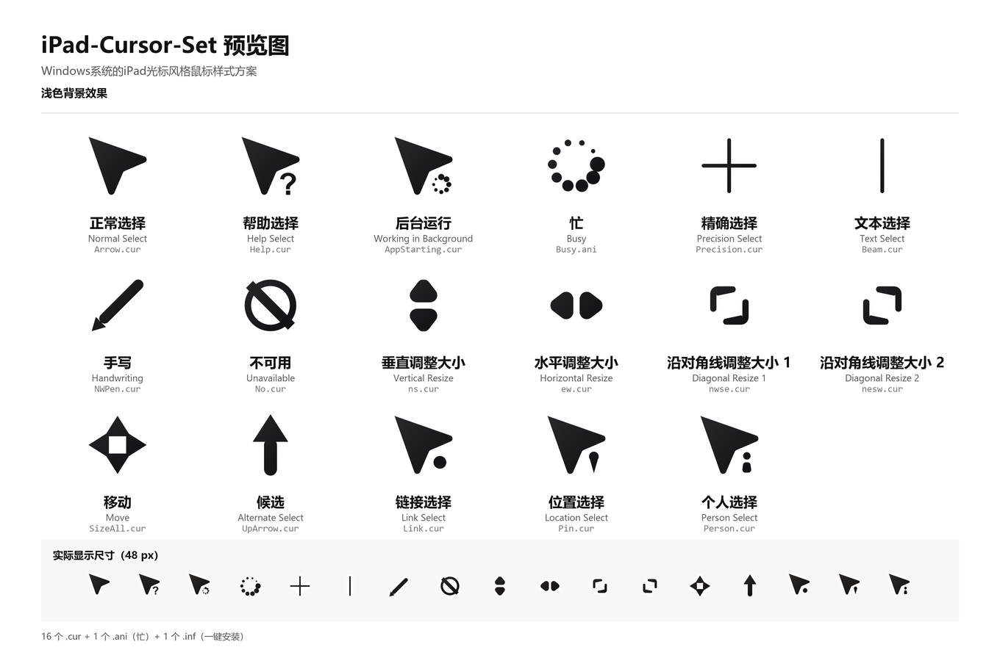
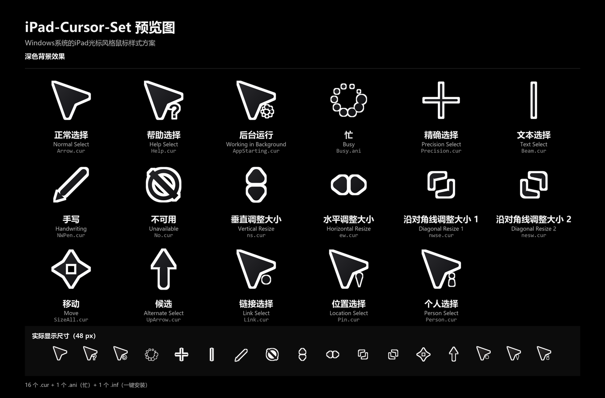

# iPad-Cursor-Set

一款 Windows 鼠标指针套装：iPad / macOS 风格的深色光标，**纯代码生成**（Python + Pillow），不含任何第三方素材。覆盖 Windows 全部 17 个指针角色：16 个静态 `.cur` + 1 个动画 `.ani`（忙）+ 一键安装 `.inf`。





当前发布版本：**v11**

---

## 特性

| 特性 | 说明 |
|:---|:---|
| 分层薄白边 | 内容外围白色薄边按图层分档：主图形 1.00 / 细小元素（角标、忙点阵）0.50 设计单位，复合形状（帮助选择、后台运行、链接选择、位置选择、个人选择）的箭头白边与「正常选择」完全一致，纯黑壁纸上依然清晰可见 |
| 11 档内嵌尺寸 | 128 / 96 / 72 / 64 / 56 / 48 / 40 / 36 / 32 / 28 / 24，非 100% DPI 缩放下锯齿更少（150% 缩放实际取 48px 帧） |
| 画布余量 | 内容绕画布中心缩至 92%，为白边预留空间，贴边形状不被裁切 |
| 全角色覆盖 | 17 个指针角色一一对应、互不重复（见下方对照表） |
| 配色 | 主体为深灰 → 近黑对角渐变（#303034 → #060608），外部为白色薄边 |
| 动画 | 忙（Busy）为 10 帧圆环点阵 spinner，48px 帧，每帧 100ms |
| 单文件多分辨率 | 每个 `.cur` 内含 11 档位图，单文件约 189 KB |

> 已在 150% 显示缩放下真机安装验证；其他缩放档位依赖 11 档内嵌尺寸匹配，未逐一真机验证。

---

## 17 个角色对照表

中文名取自 Windows 11 简体中文系统「鼠标属性 → 指针」对话框的官方字符串（`main.cpl.mui`，版本 10.0.26100）；「注册表标识」为 `HKCU\Control Panel\Cursors` 下对应的值名。

| 鼠标属性显示名 | 英文 | 注册表标识 | 文件 |
|:---|:---|:---|:---|
| 正常选择 | Normal Select | Arrow | `Arrow.cur` |
| 帮助选择 | Help Select | Help | `Help.cur` |
| 后台运行 | Working in Background | AppStarting | `AppStarting.cur` |
| 忙 | Busy | Wait | `Busy.ani`（动画） |
| 精确选择 | Precision Select | Crosshair | `Precision.cur` |
| 文本选择 | Text Select | IBeam | `Beam.cur` |
| 手写 | Handwriting | NWPen | `NWPen.cur` |
| 不可用 | Unavailable | No | `No.cur` |
| 垂直调整大小 | Vertical Resize | SizeNS | `ns.cur` |
| 水平调整大小 | Horizontal Resize | SizeWE | `ew.cur` |
| 沿对角线调整大小 1 | Diagonal Resize 1 | SizeNWSE | `nwse.cur` |
| 沿对角线调整大小 2 | Diagonal Resize 2 | SizeNESW | `nesw.cur` |
| 移动 | Move | SizeAll | `SizeAll.cur` |
| 候选 | Alternate Select | UpArrow | `UpArrow.cur` |
| 链接选择 | Link Select | Hand | `Link.cur` |
| 位置选择 | Location Select | Pin | `Pin.cur` |
| 个人选择 | Person Select | Person | `Person.cur` |

---

## 安装

### 方式一：右键安装 `.inf`（推荐）

1. 进入 `iPad-Cursor-Set\` 文件夹，右键 `iPad-Cursor-Set.inf` → 「安装」（Windows 11 需先点「显示更多选项」；UAC 弹窗选「是」）。
2. 打开 控制面板 → 鼠标 → 「指针」选项卡（或：设置 → 蓝牙和其他设备 → 鼠标 → 其他鼠标设置）。
3. 在「方案」下拉框选择 “iPad-Cursor-Set”，点「应用」→「确定」。

`.inf` 安装时做了两件事：

- 把 17 个光标文件复制到系统目录 **`C:\Windows\Cursors\iPad-Cursor-Set\`**；
- 在当前用户注册表写入方案值：`HKCU\Control Panel\Cursors\Schemes` 下的 `iPad-Cursor-Set`（17 段光标文件绝对路径的逗号拼接）。

安装完成后，仓库里的这份文件只是安装载荷副本，移动或删除仓库目录不影响已安装的方案。

### 方式二：手动逐角色设置（不用 `.inf` 时）

先把整个 `iPad-Cursor-Set\` 文件夹放到固定位置（推荐 `C:\Windows\Cursors\iPad-Cursor-Set\`），再在「鼠标属性 → 指针」的自定义列表中逐个选中角色 → 「浏览」指定对应文件，全部设置完成后点「另存为」保存为新方案。

注意：Windows 按**绝对路径**引用光标文件。把文件放在临时目录、之后移动或删除该目录，会导致方案静默失效。

---

## 删除 / 卸载

分两步，第 2 步可选（看是否需要彻底清理）：

**第 1 步：删除方案（鼠标属性 → 指针）**

1. 先把当前使用的方案切换为其他方案（如 “Windows 默认(系统方案)”)，避免在方案使用中删除；
2. 在「方案」下拉框选中 “iPad-Cursor-Set” → 点「删除」按钮 → 确认。

等价命令行（效果相同）：

```
reg delete "HKCU\Control Panel\Cursors\Schemes" /v "iPad-Cursor-Set" /f
```

说明：图形界面的「删除」按钮只删除注册表方案值，**不会删除光标文件**。

**第 2 步（可选）：删除物理文件**

如需彻底清理，以管理员身份删除系统里的光标目录：

```
C:\Windows\Cursors\iPad-Cursor-Set\
```

文件被占用时，先注销或重启后再删。

---

## 目录结构

```
Windows-iPad-Cursor-Set/
├── iPad-Cursor-Set/                # 安装载荷：17 个光标文件 + 一键安装器
│   ├── Arrow.cur … Person.cur      # 16 个静态 .cur + 1 个动画 Busy.ani
│   └── iPad-Cursor-Set.inf         # 右键「安装」一键注册方案
├── docs/assets/                    # 预览图（浅色 / 深色背景各一张）
├── LICENSE                         # MIT
└── README.md
```

---

## 生成方式声明

本套件、预览图与文档均由 AI 直接执行产出；几何形状源自对参考图像的路径解析与像素量测。

---

## 许可

本项目以 [MIT](LICENSE) 许可证开源。
